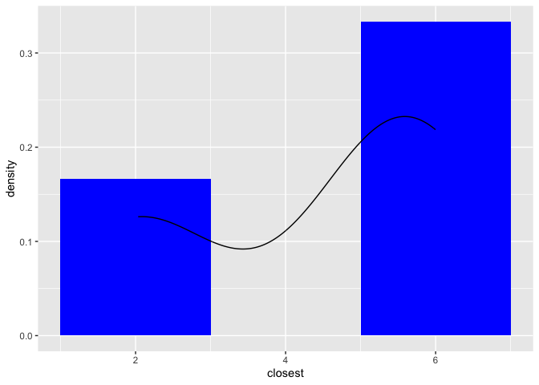
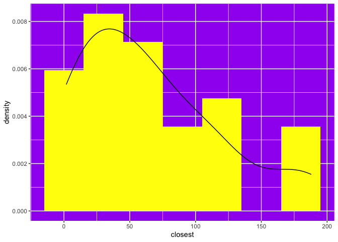
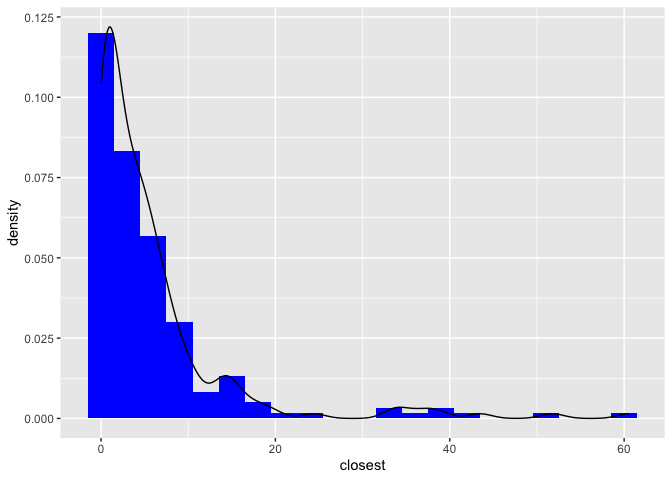
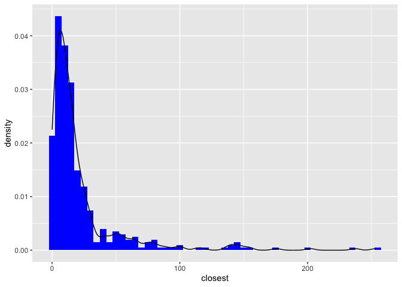

Lab 04 - La Quinta is Spanish for next to Denny’s, Pt. 2
================
Lindsey Wilson
2/7/23

### Load packages and data

``` r
library(tidyverse) 
library(dsbox) 
```

``` r
states <- read_csv("data/states.csv")
dn <- dennys
lq <- laquinta
```

### Exercise 1

The code below gives the number of Denny’s locations in Alaska:

``` r
dn_ak <- dn %>%
  filter(state == "AK")
message("There are ", nrow(dn_ak), " Denny's locations in Alaska")
```

    ## There are 3 Denny's locations in Alaska

### Exercise 2

And this tells us how many La Quinta locations are in Alaska:

``` r
lq_ak <- lq %>%
  filter(state == "AK")
message("There are ", nrow(lq_ak), " La Quinta locations in Alaska")
```

    ## There are 2 La Quinta locations in Alaska

### Exercise 3

Since there are 3 Denny’s and 2 La Quinta’s in Alaska, if we want to
calculate the distances between each pair of Denny’s and La Quinta then
in total we’ll need to calculate 6 distances.

### Exercise 4

Below we’ve used `full_join()` to put together the `dn_ak` and `lq_ak`
datasets:

``` r
dn_lq_ak <- full_join(dn_ak, lq_ak, by = "state")
dn_lq_ak
```

    ## # A tibble: 6 × 11
    ##   address.x      city.x state zip.x longi…¹ latit…² addre…³ city.y zip.y longi…⁴
    ##   <chr>          <chr>  <chr> <chr>   <dbl>   <dbl> <chr>   <chr>  <chr>   <dbl>
    ## 1 2900 Denali    Ancho… AK    99503   -150.    61.2 3501 M… "\nAn… 99503   -150.
    ## 2 2900 Denali    Ancho… AK    99503   -150.    61.2 4920 D… "\nFa… 99709   -148.
    ## 3 3850 Debarr R… Ancho… AK    99508   -150.    61.2 3501 M… "\nAn… 99503   -150.
    ## 4 3850 Debarr R… Ancho… AK    99508   -150.    61.2 4920 D… "\nFa… 99709   -148.
    ## 5 1929 Airport … Fairb… AK    99701   -148.    64.8 3501 M… "\nAn… 99503   -150.
    ## 6 1929 Airport … Fairb… AK    99701   -148.    64.8 4920 D… "\nFa… 99709   -148.
    ## # … with 1 more variable: latitude.y <dbl>, and abbreviated variable names
    ## #   ¹​longitude.x, ²​latitude.x, ³​address.y, ⁴​longitude.y

This code tells us how many observations are in our newly created
dataset, along with the names of the columns

``` r
message("There are ", nrow(dn_lq_ak), " observations in the dn_lq_ak dataset")
```

    ## There are 6 observations in the dn_lq_ak dataset

``` r
names(dn_lq_ak)
```

    ##  [1] "address.x"   "city.x"      "state"       "zip.x"       "longitude.x"
    ##  [6] "latitude.x"  "address.y"   "city.y"      "zip.y"       "longitude.y"
    ## [11] "latitude.y"

### Exercise 5

It looks like each row represents a Denny’s/La Quinta pair, so to get
the distances between each pair we can just calculate a distance column
for each row. We would do this with the `mutate()` function.

### Exercise 6

This code creates a function to calculate distance for each row:

``` r
haversine <- function(long1, lat1, long2, lat2, round = 3) {
  # convert to radians
  long1 = long1 * pi / 180
  lat1  = lat1  * pi / 180
  long2 = long2 * pi / 180
  lat2  = lat2  * pi / 180
  
  R = 6371 # Earth mean radius in km
  
  a = sin((lat2 - lat1)/2)^2 + cos(lat1) * cos(lat2) * sin((long2 - long1)/2)^2
  d = R * 2 * asin(sqrt(a))
  
  return( round(d,round) ) # distance in km
}
```

Which allows us to calculate a distance variable for each row in
`dn_lq_ak`:

``` r
dn_lq_ak <- dn_lq_ak %>%
  mutate(distance = haversine(longitude.x,
                              latitude.x,
                              longitude.y,
                              latitude.y
                              ))
```

### Exercise 7

The code below generates a data frame that has one observation for each
Denny’s location, along with the distance to the closest La Quinta:

``` r
dn_lq_ak_mindist <- dn_lq_ak %>%
  group_by(address.x) %>%
  summarize(closest = min(distance))
```

### Exercise 8

We can use the data frame we generated in exercise 7 to summarize the
distribution of distances between Denny’s and the nearest La Quinta:

``` r
ggplot(data = dn_lq_ak_mindist, mapping = aes(x = closest)) + 
  geom_histogram(aes(y = after_stat(density)),
                     binwidth = 2, 
                     fill = "Blue") + 
  geom_density()
```

<!-- -->

``` r
message("Mean = ", mean(dn_lq_ak_mindist$closest), " miles.")
```

    ## Mean = 4.41 miles.

``` r
message("SD = ", sd(dn_lq_ak_mindist$closest), " miles.")
```

    ## SD = 2.0954400492498 miles.

With only 3 Denny’s locations we can’t say much about the shape of the
distribution, but the descriptives at least make it seem like Denny’s
and La Quinta locations are pretty close together.

### Exercise 9

We’re now going to repeat this analysis pipeline for the state of North
Carolina. The code to do that is below:

``` r
#Filters Denny's for NC locations
dn_nc <- dn %>%
  filter(state == "NC")

#Filter La Quinta for NC locations
lq_nc <- lq %>%
  filter(state == "NC")

#Join dn_nc and lq_nc datasets by state
dn_lq_nc <- full_join(dn_nc, lq_nc, by = "state")

#Calculate distances between all Dennys-LaQuinta pairs
dn_lq_nc <- dn_lq_nc %>%
  mutate(distance = haversine(longitude.x,
                              latitude.x,
                              longitude.y,
                              latitude.y
                              ))

#Find minimum distance to a La Quinta for each Denny's
dn_lq_nc_mindist <- dn_lq_nc %>%
  group_by(address.x) %>%
  summarize(closest = min(distance))

#Histogram and descriptives of minimum distances 
#(horrible yellow and purple graph is on purpose)
ggplot(data = dn_lq_nc_mindist, mapping = aes(x = closest)) + 
  geom_histogram(aes(y = after_stat(density)),
                 binwidth = 30, 
                 fill = "Yellow") + 
  geom_density() +
  theme(panel.background = element_rect(fill = "Purple"))
```

<!-- -->

``` r
message("Mean = ", mean(dn_lq_nc_mindist$closest), " miles.")
```

    ## Mean = 65.4443214285714 miles.

``` r
message("SD = ", sd(dn_lq_nc_mindist$closest), " miles.")
```

    ## SD = 53.4239780131048 miles.

Right away we can see from this analysis that there are many more
Denny’s locations in NC than in Alaska, and that on average they’re much
further away from the nearest La Quinta. However, it doesn’t really feel
valid to compare the two states because, again, there were only 3
Denny’s locations in Alaska at all.

### Exercise 10

Let’s repeat the same analysis for Texas:

``` r
#Filters Denny's for TX locations
dn_tx <- dn %>%
  filter(state == "TX")

#Filter La Quinta for TX locations
lq_tx <- lq %>%
  filter(state == "TX")

#Join dn_tx and lq_tx datasets by state
dn_lq_tx <- full_join(dn_tx, lq_tx, by = "state")

#Calculate distances between all Dennys-LaQuinta pairs
dn_lq_tx <- dn_lq_tx %>%
  mutate(distance = haversine(longitude.x,
                              latitude.x,
                              longitude.y,
                              latitude.y
                              ))

#Find minimum distance to a La Quinta for each Denny's
dn_lq_tx_mindist <- dn_lq_tx %>%
  group_by(address.x) %>%
  summarize(closest = min(distance))

#Histogram and descriptives of minimum distances 
ggplot(data = dn_lq_tx_mindist, mapping = aes(x = closest)) + 
  geom_histogram(aes(y = after_stat(density)),
                 binwidth = 3, 
                 fill = "Blue") + 
  geom_density()
```

<!-- -->

``` r
message("Mean = ", mean(dn_lq_tx_mindist$closest), " miles.")
```

    ## Mean = 5.7918 miles.

``` r
message("SD = ", sd(dn_lq_tx_mindist$closest), " miles.")
```

    ## SD = 8.83071486091437 miles.

### Exercise 11

And for California:

``` r
#Filters Denny's for CA locations
dn_ca <- dn %>%
  filter(state == "CA")

#Filter La Quinta for CA locations
lq_ca <- lq %>%
  filter(state == "CA")

#Join dn_ca and lq_ca datasets by state
dn_lq_ca <- full_join(dn_ca, lq_ca, by = "state")

#Calculate distances between all Dennys-LaQuinta pairs
dn_lq_ca <- dn_lq_ca %>%
  mutate(distance = haversine(longitude.x,
                              latitude.x,
                              longitude.y,
                              latitude.y
                              ))

#Find minimum distance to a La Quinta for each Denny's
dn_lq_ca_mindist <- dn_lq_ca %>%
  group_by(address.x) %>%
  summarize(closest = min(distance))

#Histogram and descriptives of minimum distances 
ggplot(data = dn_lq_ca_mindist, mapping = aes(x = closest)) + 
  geom_histogram(aes(y = after_stat(density)),
                 binwidth = 5, 
                 fill = "Blue") + 
  geom_density()
```

<!-- -->

``` r
message("Mean = ", mean(dn_lq_ca_mindist$closest), " miles.")
```

    ## Mean = 22.0832084367246 miles.

``` r
message("SD = ", sd(dn_lq_ca_mindist$closest), " miles.")
```

    ## SD = 33.0491475509883 miles.

### Exercise 12

From these analyses, it looks like Texas is the state where the Mitch
Hedberg joke seems the most applicable. It has enough observations to be
able to draw solid conclusions about it (unlike Alaska), and it has both
the smallest mean Dennys-to-La Quinta distance and the smallest standard
deviation. The distribution of minimum distances is also extremely
positively skewed (not unlike the others), meaning that the actual
center of the minimum distance distribution is likely somewhat smaller
than the mean is indicating.

Just to drive that intuition home, we can calculate the median distances
below:

``` r
message("NC median = ", median(dn_lq_nc_mindist$closest), " miles") +
message("TX median = ", median(dn_lq_tx_mindist$closest), " miles") +
message("CA median = ", median(dn_lq_ca_mindist$closest),  " miles")
```

    ## NC median = 53.4565 miles

    ## TX median = 3.3715 miles

    ## CA median = 11.897 miles

    ## integer(0)

So. there we have it. “La Quinta” is Spanish for “next to a Dennys”, but
that’s especially true in Texas.
